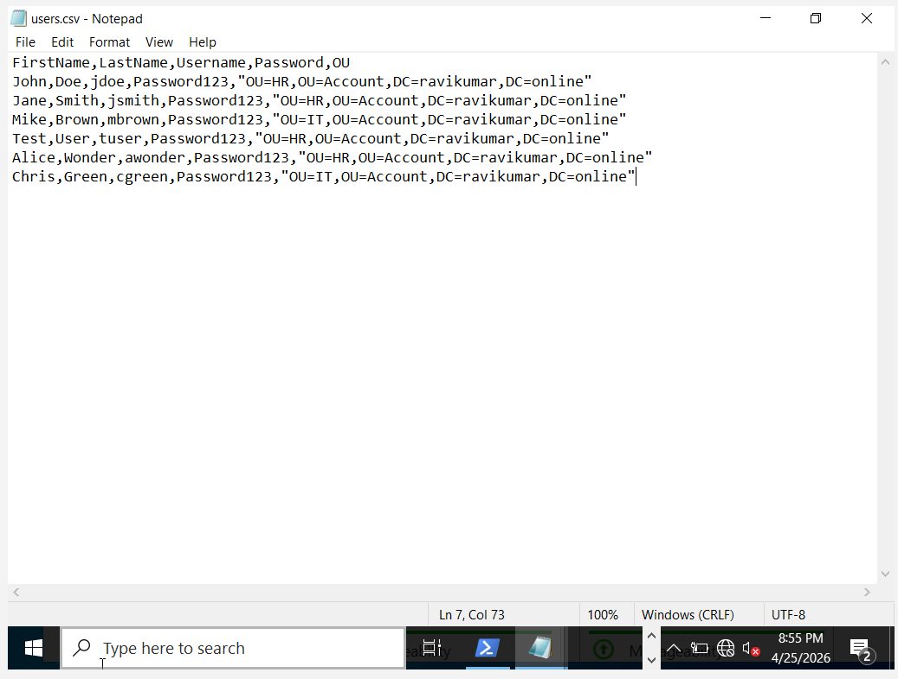
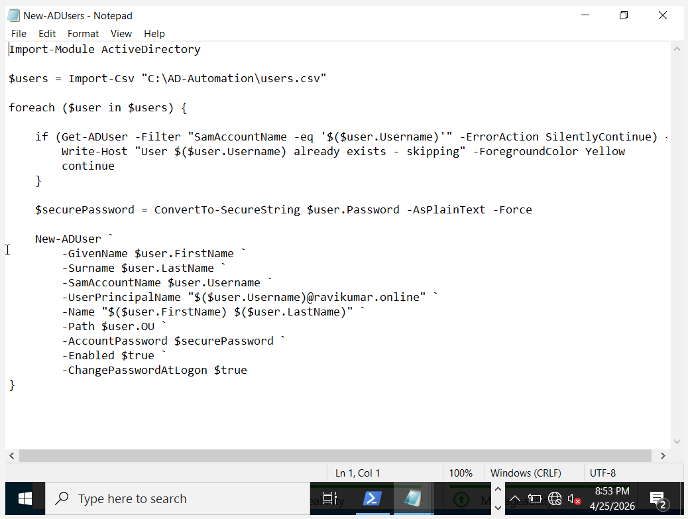
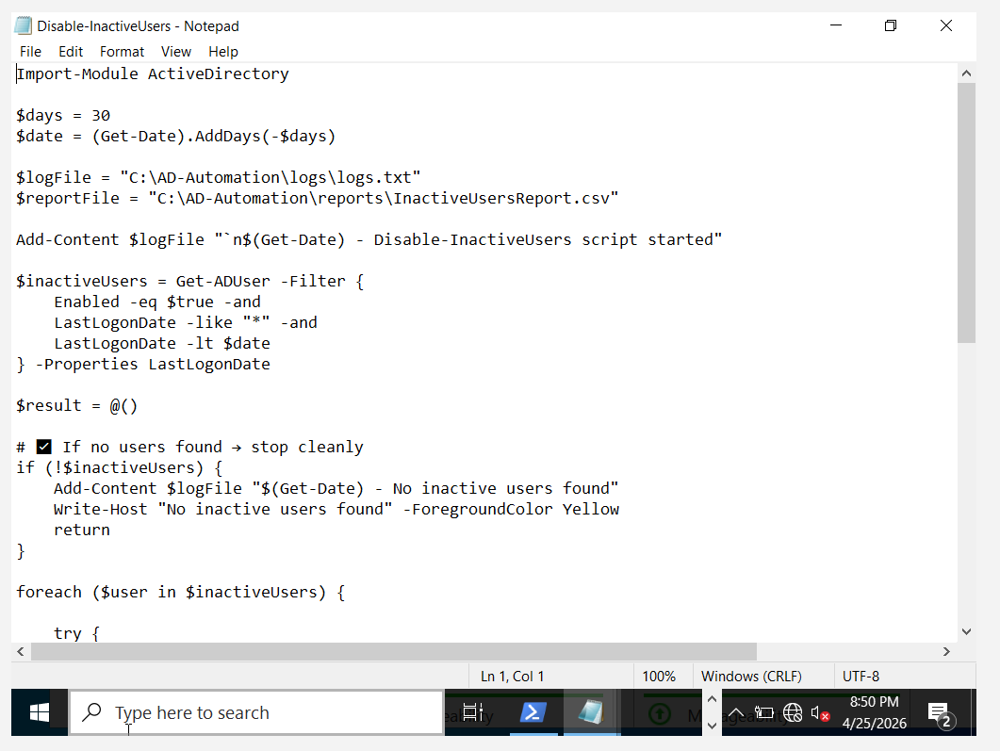
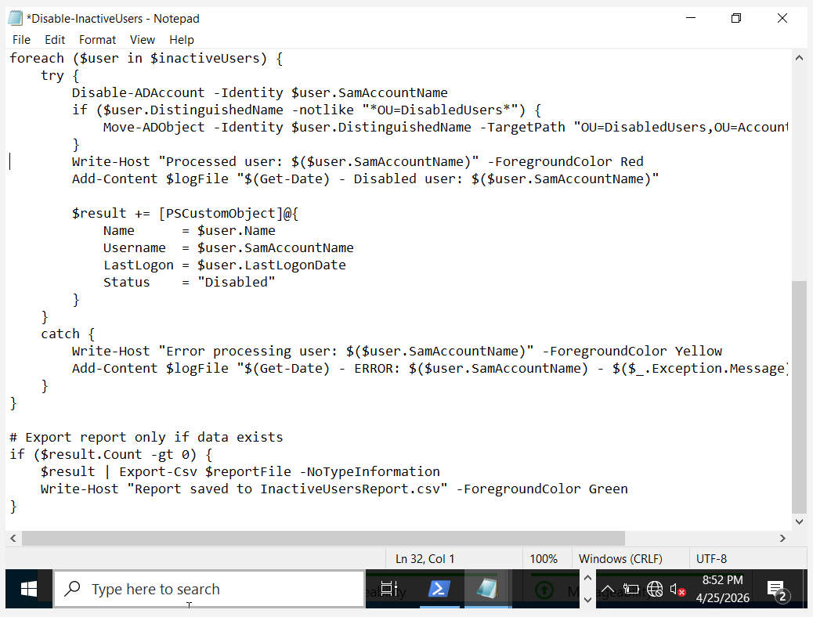
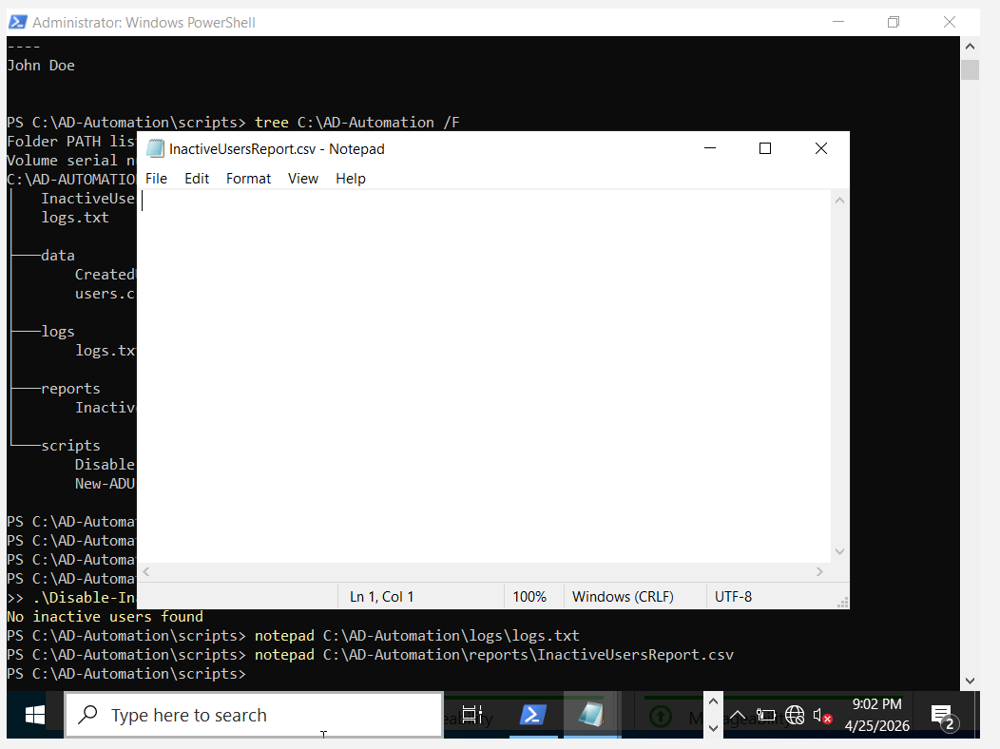
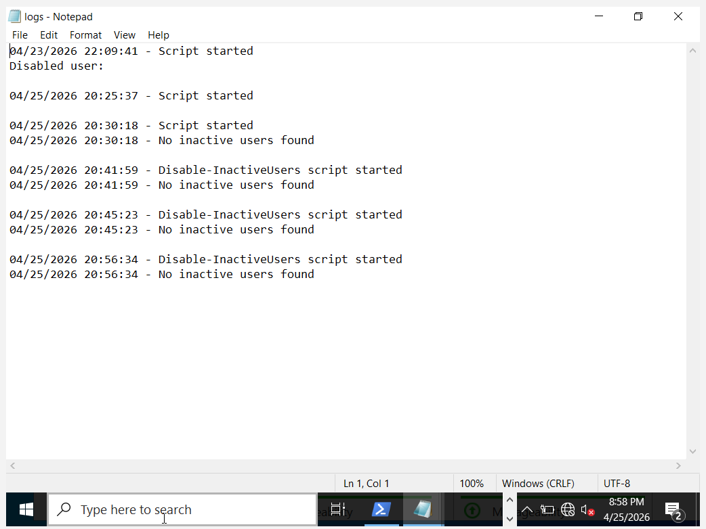
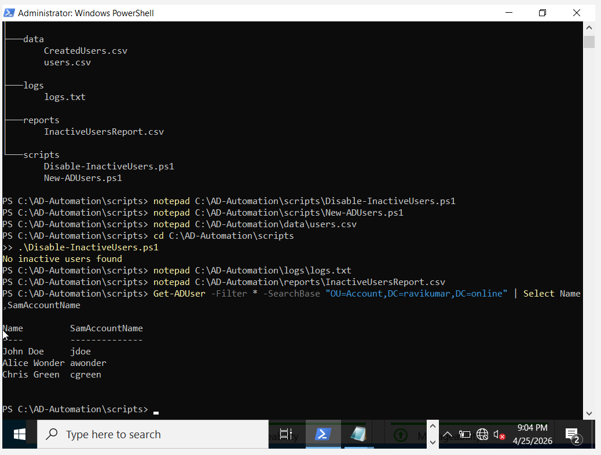

Active Directory Automation with PowerShell

📌 Project Overview

This project automates common Active Directory (AD) administrative tasks using PowerShell, including:

Bulk user creation from CSV

Automatic user placement into Organizational Units (OUs)

Secure password handling

Inactive user detection and reporting

Logging for audit and troubleshooting

It simulates real-world enterprise AD automation used in system administration environments.

⚙️ Technologies Used

Windows Server Active Directory (AD DS)

PowerShell

CSV data input

🚀 Features

1. Bulk User Creation

Creates multiple AD users from a CSV file.

Key actions:

Sets First Name, Last Name, Username, Password

Places users into correct OU

2. Secure Password Handling

Passwords from CSV are converted to secure strings before AD creation.

Forces password change at first login

Enables account automatically

Assigns User Principal Name (UPN)

3. Inactive User Detection

Identifies users who have not logged in within a defined time period (e.g., 30 days).

4. Reporting System

Generates CSV reports for inactive users for auditing purposes.

5. Logging

Maintains logs for:

Script execution

Errors

User actions

📜 Sample User CSV Format

FirstName,LastName,Username,Password,OU

John,Doe,jdoe,P@ssw0rd123,"OU=HR,OU=Account,DC=ravikumar,DC=online"

Jane,Smith,jsmith,P@ssw0rd123,"OU=HR,OU=Account,DC=ravikumar,DC=online"

Mike,Brown,mbrown,P@ssw0rd123,"OU=IT,OU=Account,DC=ravikumar,DC=online"

▶️ How to Run

1. Open PowerShell as Administrator

2. Allow script execution (if needed)

Set-ExecutionPolicy RemoteSigned -Scope Process

3. Run user creation script

cd C:\AD-Automation\scripts

.\New-ADUsers.ps1

4. Verify users

Get-ADUser -Filter * -SearchBase "OU=Account,DC=ravikumar,DC=online" | Select Name,SamAccountName

📊 Example Output

Name         SamAccountName

----         --------------

John Doe     jdoe

Alice Wonder awonder

Chris Green  cgreen

🔐 Security Notes

Execution policy is set temporarily for script execution

📌 Key Learnings

Active Directory automation using PowerShell

OU-based user management

Real-world IT admin scripting

Automation of identity lifecycle tasks

👨‍💻 Author

Ravi Kumar

Windows Server & Active Directory Automation Project
